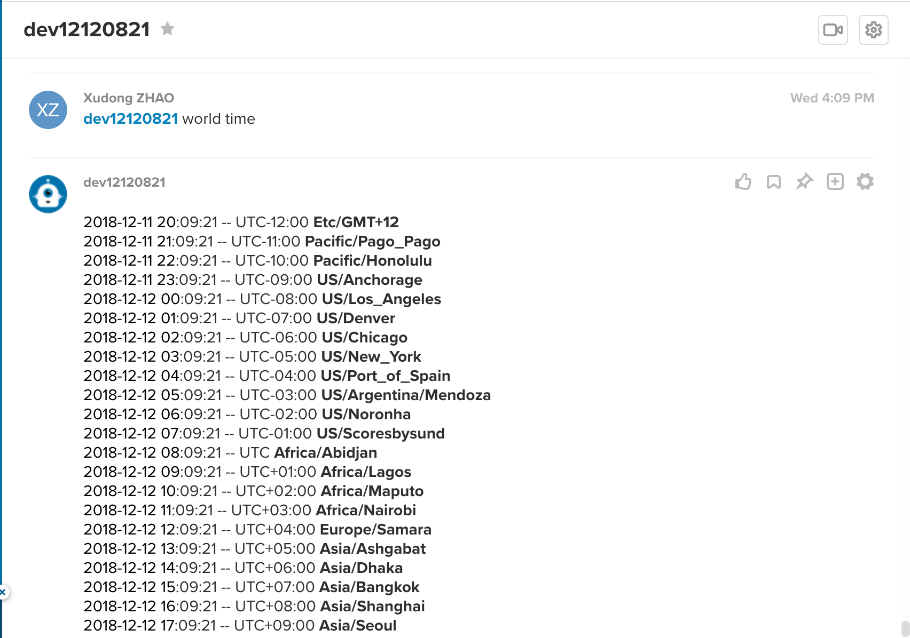

# [ringcentral-chatbot-python-ext-world-time](https://github.com/zxdong262/ringcentral-chatbot-python-ext-world-time) <!-- omit in toc -->

Simple ringcentral chatbot python extension that add `world time` command support.



## Table of contents <!-- omit in toc -->

- [Use](#use)
- [Prerequisites](#prerequisites)
- [Quick start](#quick-start)
- [Test bot](#test-bot)
- [License](#license)

## Use

Just follow [ringcentral-chatbot-python#use-extensions](https://github.com/zxdong262/ringcentral-chatbot-python#use-extensions), set `EXTENSIONS=ringcentral_bot_framework_extension_world_time`

## Prerequisites

- Python3.6+ and Pip3
- Create the bot App: Login to [developer.ringcentral.com](https://developer.ringcentral.com) and create an `public` `Server/Bot` app with permissions: `ReadContacts, ReadMessages, ReadPresence, Contacts, ReadAccounts, SMS, InternalMessages, ReadCallLog, ReadCallRecording, WebhookSubscriptions, Glip`

## Quick start

```bash

# use virtualenv
pip3 install virtualenv # might need sudo

# init virtual env
virtualenv venv --python=python3

# use env
source ./venv/bin/activate

# install deps
pip install -r requirements.txt

# run ngrok proxy
# since bot need https server,
# so we need a https proxy for ringcentral to visit our local server
./bin/proxy
# will show:
# Forwarding https://xxxxx.ngrok.io -> localhost:8989

# create env file
cp .sample.env .env
# then edit .env, set proper setting,
# and goto your ringcentral app setting page, set OAuth Redirect URI to https://https://xxxxx.ngrok.io/bot-oauth
RINGCENTRAL_BOT_SERVER=https://xxxxx.ngrok.io

## for bots auth required, get them from your ringcentral app page
RINGCENTRAL_BOT_CLIENT_ID=
RINGCENTRAL_BOT_CLIENT_SECRET=

# create bot config
cp config.sample.py config.py

# run local dev server
./bin/start
```

## Test bot

- Goto your ringcentral app's bot section, click 'Add to glip'
- Login to [https://glip-app.devtest.ringcentral.com](https://glip-app.devtest.ringcentral.com), find the bot by searching its name. Talk to the bot.
- Edit config.py to change bot bahavior and test in [https://glip-app.devtest.ringcentral.com](https://glip-app.devtest.ringcentral.com)

## License

MIT
